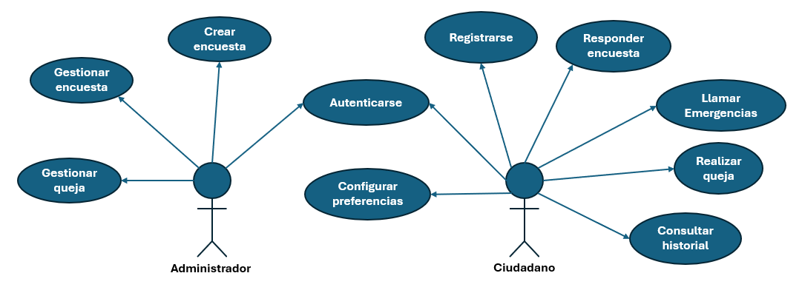
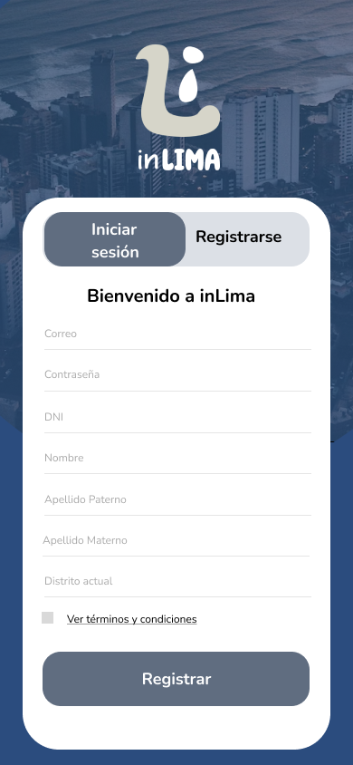
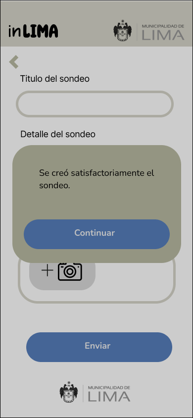
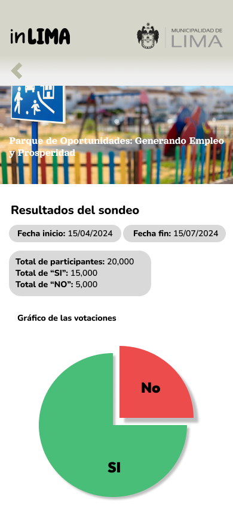
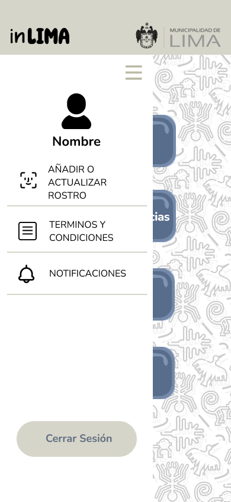

# InLima - Grupo 4 🚀
La aplicación de InLima permite a los usuarios generar reportes de problemas en su entorno urbano, como incidentes, quejas y solicitudes de mejora. Los reportes incluyen descripciones detalladas, ubicaciones (gracias a la integración con la 🗺️API de Google Maps) y la posibilidad de adjuntar fotos como evidencia.

Los administradores pueden gestionar estos reportes, atendiendo las quejas por distrito, modificando el estado de los incidentes, y notificando automáticamente a los usuarios sobre los cambios a través de la 📧 API de Gmail.


InLima también ofrece una funcionalidad de sondeos 📊, donde los usuarios pueden votar 👍👎 en encuestas sobre proyectos urbanos, ayudando a las autoridades locales a tomar decisiones basadas en la opinión pública. Los administradores pueden crear 📝 y gestionar encuestas, consultando los resultados 📈 para una toma de decisiones más participativa.

# Guía de Desarrollo para la Aplicación **InLima**

### 🚀 Breve Descripción del Entorno de Desarrollo 💻

El entorno de desarrollo para la aplicación **InLima** está construido sobre **Flutter**, una tecnología de desarrollo multiplataforma que permite crear aplicaciones móviles de alto rendimiento para **iOS** y **Android**. Además, **Android Studio** se utiliza para gestionar emuladores, entornos de desarrollo y los SDKs necesarios para la ejecución en dispositivos **Android**.

> **Flutter**: [Sitio oficial de Flutter](https://flutter.dev)  
> **Android Studio**: [Sitio oficial de Android Studio](https://developer.android.com/studio)

---

### 📥 Descarga e Instalación del SDK de Flutter

Para comenzar con Flutter, sigue estos pasos:

1. Visita el sitio oficial de **Flutter** en [flutter.dev](https://flutter.dev) y descarga el archivo ZIP del SDK correspondiente a tu sistema operativo.
2. Descomprime el archivo en una ubicación sin espacios o caracteres especiales en la ruta.
   - **Ejemplo de ruta recomendada**: `C:\flutter\` o `/usr/local/flutter/`.

⚠️ **Importante**: Evita descomprimir Flutter en directorios como `C:\Program Files\` debido a posibles restricciones de permisos.

---

### 🛠️ Configuración de Variables de Entorno

Después de instalar Flutter, es necesario configurar las variables de entorno para que el sistema pueda reconocer los comandos de **Flutter**.

1. Abre las **Propiedades del Sistema**:
   - Ve a **Panel de control** > **Sistema y seguridad** > **Sistema** > **Configuración avanzada del sistema**.
2. En la ventana emergente, selecciona **Variables de entorno**.
3. Dentro de **Variables del sistema**, localiza la variable **Path** y selecciona **Editar**.
4. Agrega una nueva entrada con la ruta completa hacia la carpeta `flutter/bin` (donde descomprimiste Flutter).
   - **Ejemplo**: `C:\flutter\bin\` o `/usr/local/flutter/bin`.

💡 **Consejo**: Asegúrate de que el comando `flutter` esté disponible en tu terminal ejecutando `flutter --version`.

---

### ✅ Verificación de la Instalación de Flutter

Para asegurarte de que todo está configurado correctamente:

1. Abre una ventana de **Símbolo del sistema**, **PowerShell** o una terminal en tu sistema operativo.
2. Ejecuta el siguiente comando:

   ```bash
   flutter doctor

## Diagrama de despliegue 🌐

## Requerimientos no funcionales 📋
#### RNF1 - Rendimiento:
- Las interfaces principales deben cargar en menos de 3 segundos con conexión 3G o superior.
- Soporte para 100 usuarios simultáneos sin pérdida de rendimiento.
- La latencia de comunicación con APIs externas (Google, Firebase, Cloud Storage) debe ser menor a 500 ms.

#### RNF2 - Seguridad:
- Cifrado de datos en reposo y en tránsito (HTTPS, AES 256 bits).
- Comunicación segura entre servicios (TLS/SSL) y almacenamiento cifrado de archivos adjuntos.
- Cumplimiento con normativas locales de protección de datos (ej. Ley N° 29733 en Perú).

#### RNF3 - Disponibilidad:
- Disponibilidad del sistema al 99.5% del tiempo anual.
- Tiempo de inactividad máximo de 24 horas por año.
- Plan de contingencia para fallos en servicios externos (APIs, Firebase, Cloud Storage).

#### RNF4 - Escalabilidad:
- Capacidad de escalar hasta 400 usuarios simultáneos.
- Permitir agregar nuevas funcionalidades o integrar servicios externos sin reescritura significativa.
- Manejo eficiente de mayores cargas de notificaciones y almacenamiento.

#### RNF5 - Usabilidad:
- Interfaz intuitiva y accesible (WCAG 2.1), con retroalimentación visual y auditiva.
- Formularios y botones claros para usuarios de todos los niveles.

#### RNF6 - Compatibilidad:
- Compatible con las últimas versiones de Android y distintos tamaños de pantalla.
- Adaptable a actualizaciones menores de APIs de Google (Maps, Facial Detection, Gmail).
- Interfaz responsiva para múltiples dispositivos.
## Diagrama de casos de uso 🛠️


## Descripción de casos de uso 📝

### 1. Registro de Usuario
- **RF1:** El sistema debe permitir al ciudadano registrarse proporcionando correo, contraseña, DNI, nombre, apellidos y distrito actual.




### 2. Autenticación de Usuario
- **RF2:** El sistema debe permitir al usuario iniciar sesión validando el correo y la contraseña proporcionados con los datos de la base de datos.


- **RF3:** El sistema debe permitir al usuario iniciar sesión utilizando identificación facial.


- **RF4:** El sistema debe proporcionar una opción de recuperación de contraseña. Al hacer clic en "Olvidé mi contraseña", el usuario debe poder ingresar su correo electrónico para recibir un enlace de restablecimiento de contraseña.


### 3. Acceso al Menú Principal
- **RF5:** El sistema debe llevar al usuario al **menú principal** después de iniciar sesión, donde podrá acceder a las siguientes opciones:
   - **SOS:** Acceso rápido a servicios de emergencia (en caso sea ciudadano).
   - **Quejas/Sugerencias:** Permite generar y gestionar quejas.
   - **Sondeos:** Acceso a encuestas y votaciones.
   - **Historial:** Acceso al historial de quejas propio del usuario (en caso sea ciudadano).
 


### 4. Gestión de Quejas y Sugerencias
- **RF6:** El sistema debe permitir al ciudadano seleccionar el tipo de queja o sugerencia desde una lista de opciones predefinidas o la opción 'Otros'.


- **RF7:** El sistema debe permitir al ciudadano detallar el problema o sugerencia relacionado con el tipo seleccionado.


- **RF8:** El sistema debe mostrar al ciudadano el historial de quejas previas enviadas, incluyendo detalles como el asunto y una imagen asociada.


- **RF9:** El sistema debe permitir al administrador revisar una lista de quejas o sugerencias recibidas, clasificadas por tipo de queja.


- **RF10:** El sistema debe permitir al administrador modificar el estado de las quejas.


### 5. Gestión de Encuestas y Votaciones
- **RF12:** El sistema debe mostrar al ciudadano una lista de proyectos disponibles para votar, acompañados de imágenes y descripciones.


- **RF13:** El sistema debe permitir al ciudadano votar a favor o en contra de los proyectos mediante botones de "De acuerdo" o "Desacuerdo".

 

- **RF14:** El sistema debe permitir al administrador crear encuestas ingresando el título y el detalle o descripción del sondeo.

 
 
- **RF15:** El sistema debe permitir al administrador consultar los resultados de las encuestas.

 

### 6. Acceso a Servicios de Emergencia
- **RF16:** El sistema debe permitir al ciudadano visualizar una lista de servicios de emergencia disponibles, como SAMU, PNP, Bomberos y Central de Serenazgo.


### 7. Configuración y Preferencias del Usuario

- **RF17:** El sistema debe permitir al usuario acceder a una barra lateral con diferentes opciones de configuración después de iniciar sesión. El usuario podrá desplegar esta barra lateral desde el ícono de menú y acceder a las opciones de "Añadir o actualizar rostro", "Términos y condiciones", "Notificaciones" y "Cerrar sesión".



- **RF18:** El sistema debe permitir al ciudadano activar o desactivar las notificaciones push desde la configuración.


- **RF19:** El sistema debe mostrar el nombre del usuario y permitirle agregar o actualizar su rostro para el inicio de sesión con identificación facial.

 
 
 

- **RF20:** El sistema debe permitir al ciudadano visualizar y gestionar los "Términos y condiciones".


- **RF21:** El sistema debe permitir al ciudadano cerrar sesión desde la pantalla de ajustes.


## Integrantes 👥

- Marcelo Cabrejos Benites (20200333)
- Renzo Tipula Cochachin (20202084)
- Roberto Lopez Jauregui (20201192)
- Arturo Silvera Pocco (20204965)
- Rafael Calderon la Rosa (20200349)

## License

This project is open-source and free to use under the [MIT License](LICENSE).
